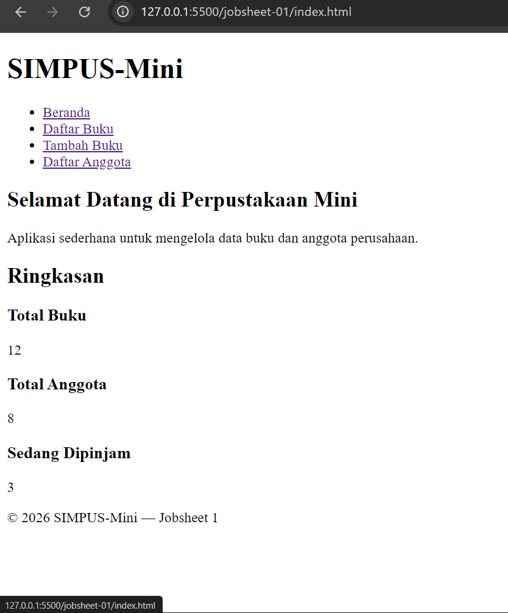
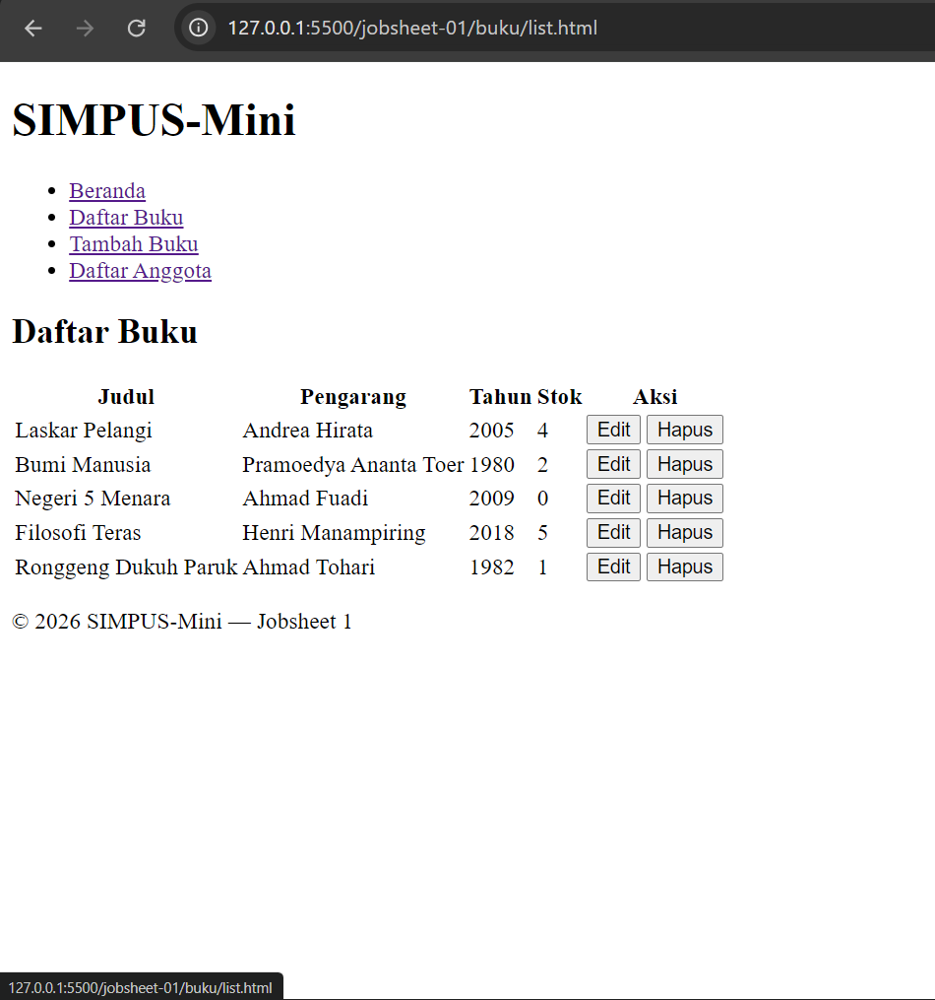
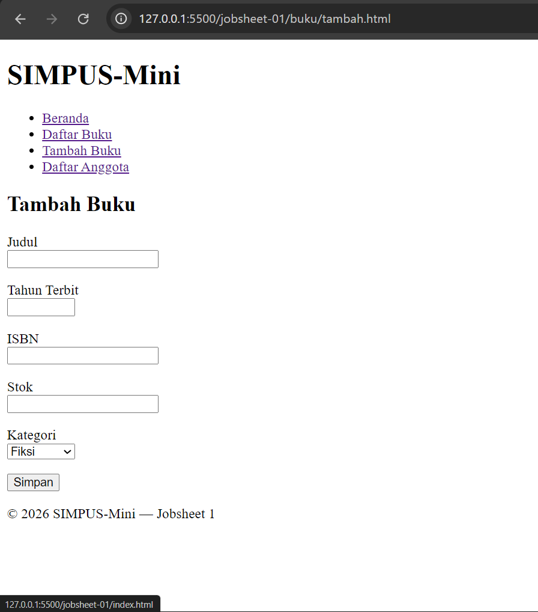
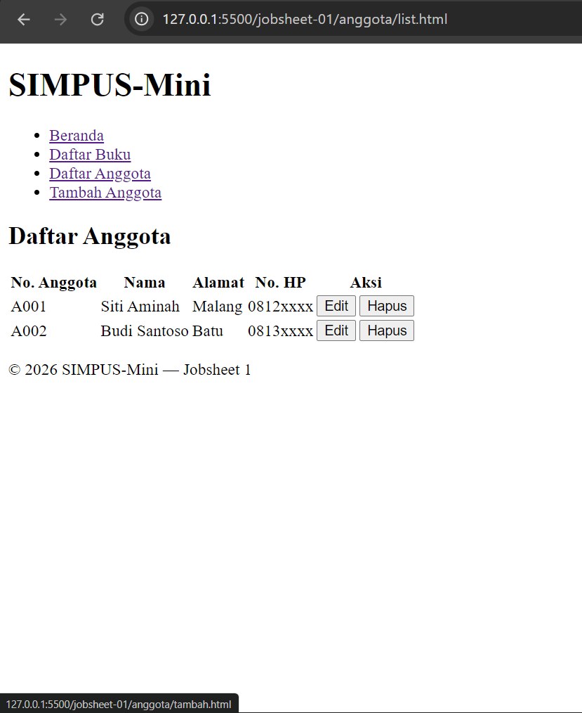
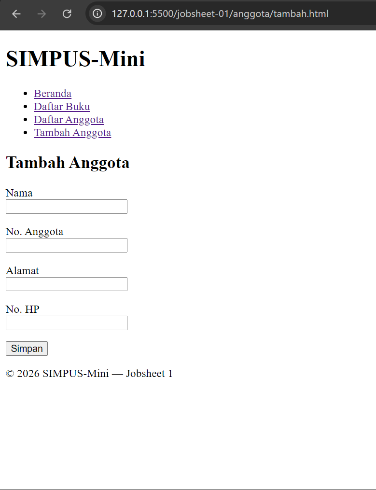

# Jobsheet 1 — HTML5 Semantic Skeleton

### Nama : Achmad Pradita Dwi Firmansyah

### Kelas / Absen : TI-2G / 01

### NIM : 254107020130

Sub-CPMK: Menyusun struktur halaman web dengan HTML5 semantic.

## Isi tahap ini

- `index.html` — Beranda dengan ringkasan statistik (dummy).

  

- `buku/list.html` — tabel daftar buku statis (5 baris dummy).

  

- `buku/tambah.html` — form tambah buku (belum diproses).

  

- `anggota/list.html` — tabel daftar anggota statis (tugas mandiri).

  

- `anggota/tambah.html` — form tambah anggota (tugas mandiri).

  

## Catatan

- Belum ada CSS/JS — fokus murni pada struktur semantic (`header`, `nav`, `main`, `section`, `article`, `footer`) dan penamaan atribut `name`/`id` yang akan dipakai kembali di jobsheet berikutnya.
