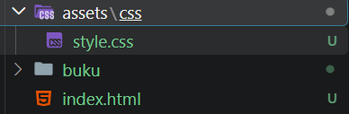
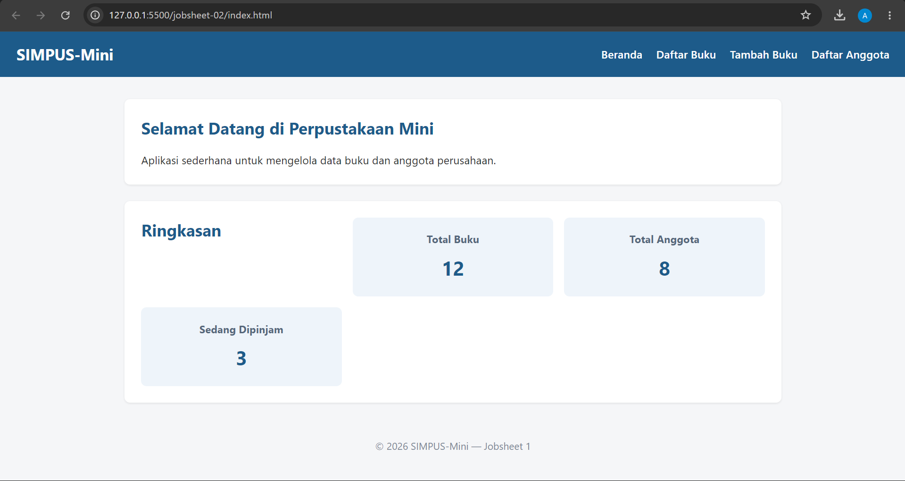
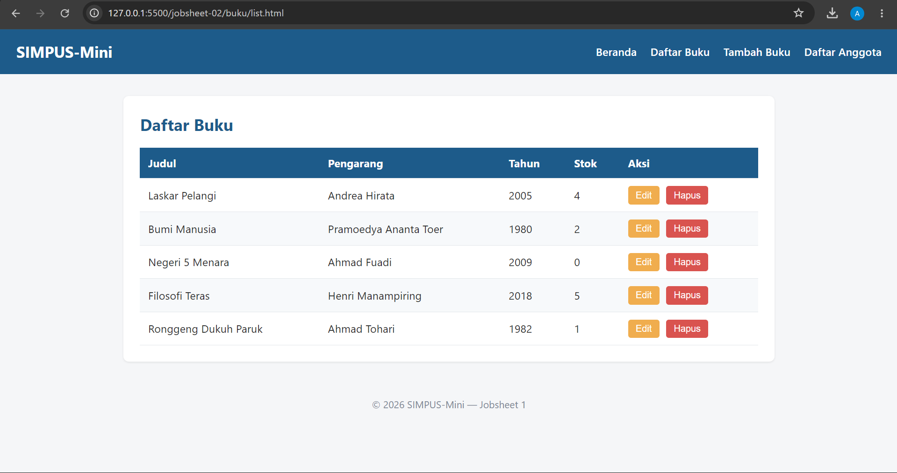
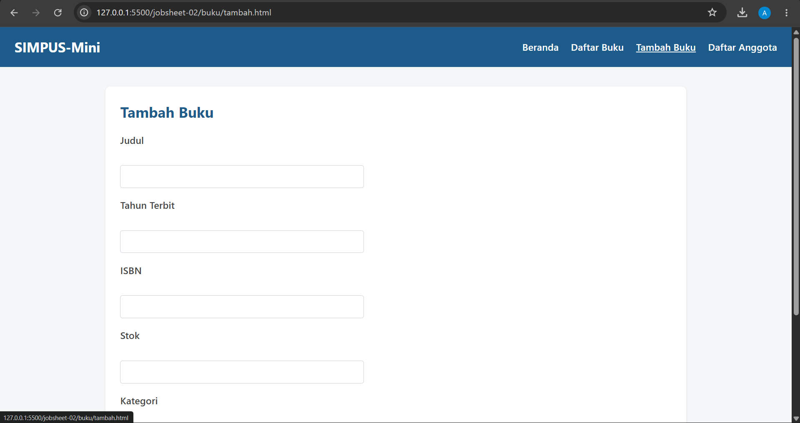
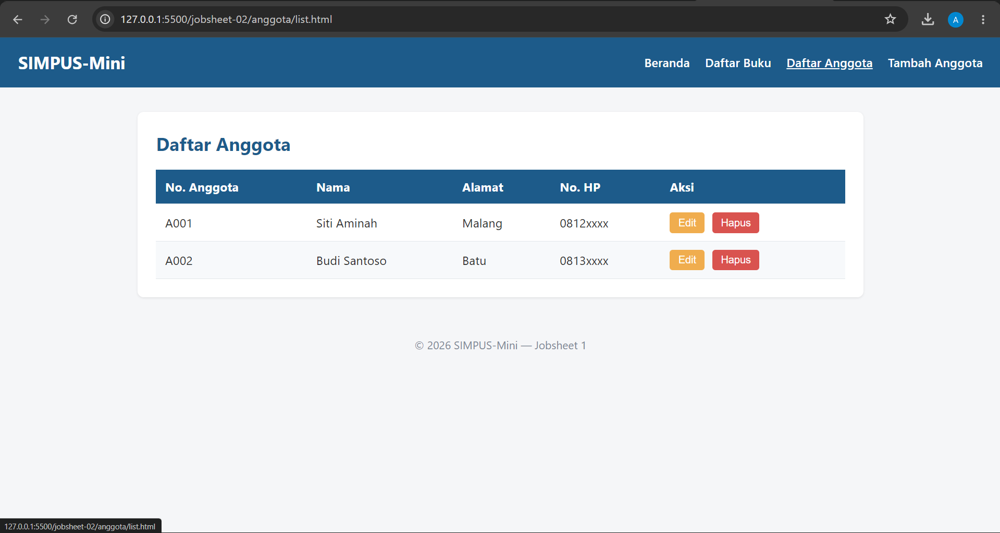
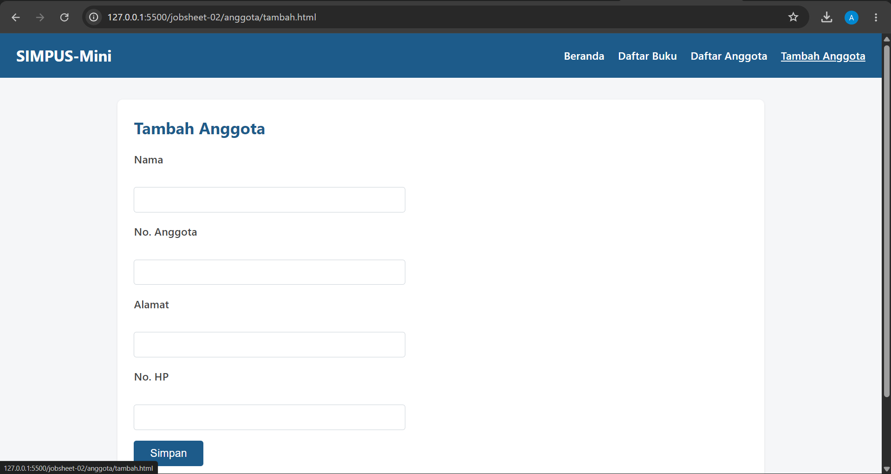

# Jobsheet 2 — CSS3 Styling Dasar

Sub-CPMK: Mengimplementasikan styling dasar dengan CSS3.

## Perubahan dari Jobsheet 1

- Tambah `assets/css/style.css` (box model, Flexbox untuk navbar, CSS Grid untuk kartu statistik Beranda).
  
- Semua halaman `.html` ditambahkan `<link rel="stylesheet">` ke `style.css` (path relatif menyesuaikan kedalaman folder).
  
- Struktur HTML **tidak diubah** — hanya tampilan.

## - index.html

## buku/list.html

## buku/tambah.html

## anggota/list.html

## anggota/tambah.html

## Catatan

- Kartu statistik di Beranda memakai `main section:nth-of-type(2)` sebagai grid 3 kolom.
- Class CSS bersifat generik (berbasis tag semantic + `nth-child`) agar bisa dipakai ulang di halaman Anggota tanpa duplikasi class.
