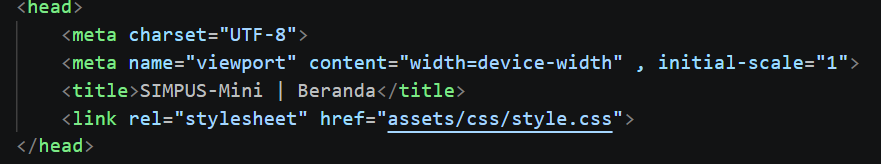
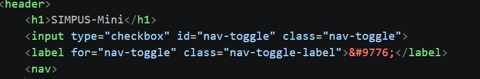
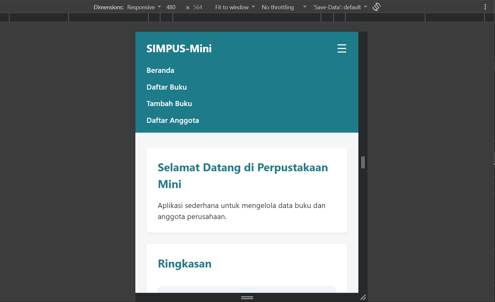
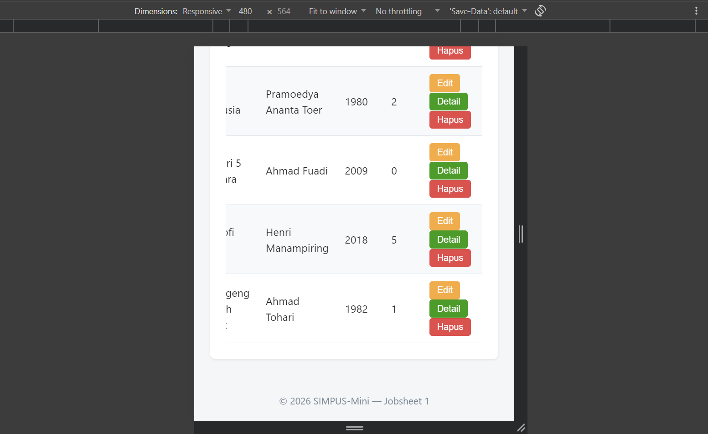
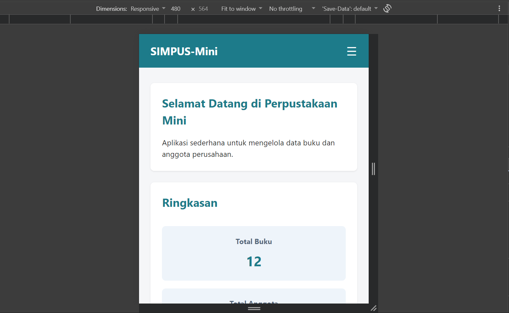
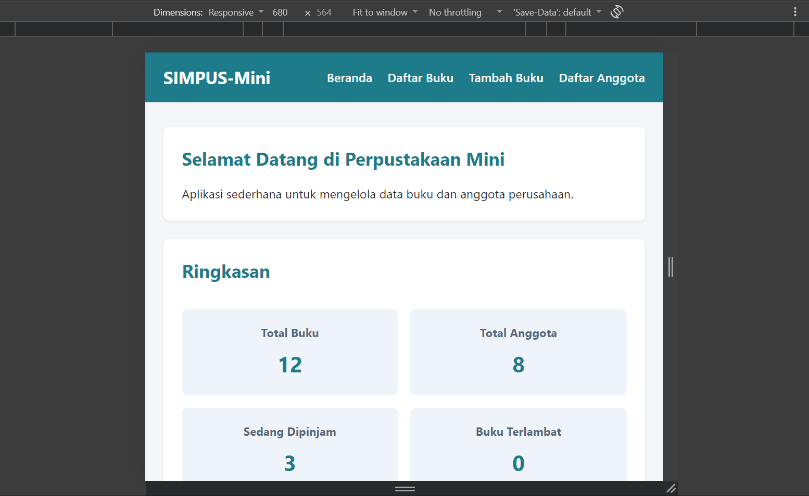
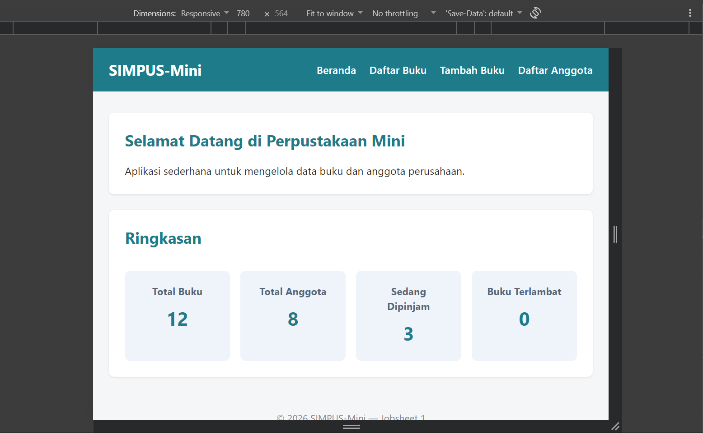
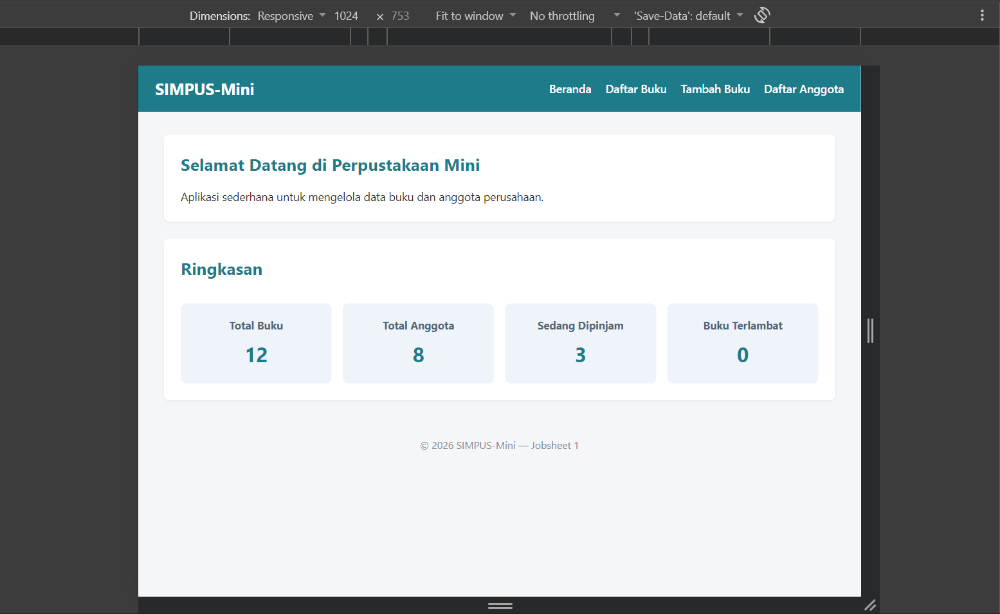

# Jobsheet 3 — Responsive Design

### Nama : Achmad Pradita Dwi Firmansyah

### Kelas / Absen : TI-2G / 01

### NIM : 254107020130

Sub-CPMK: Membangun tampilan responsif.

## Perubahan dari Jobsheet 2

- Tambah `<meta name="viewport">` di semua halaman.

  

- Navbar: hamburger menu memakai teknik **checkbox hack** murni CSS (`input[type=checkbox] + label`), aktif di layar ≤480px.

  

  

- Tabel dibungkus `<div class="table-responsive">` agar bisa di-scroll horizontal di layar sempit.

  

- Tambah media query di `style.css`: grid kartu statistik 3 → 2 → 1 kolom mengikuti breakpoint tablet/mobile.

```
@media (max-width: 768px) {
  main section:nth-of-type(2) {
    grid-template-columns: repeat(2, 1fr);
  }

  main section:nth-of-type(2) h2 {
    grid-column: span 2;
  }
}

/* Mobile */
@media (max-width: 480px) {
  header {
    position: relative;
  }

  .nav-toggle-label {
    display: block;
  }

  header nav {
    display: none;
    width: 100%;
    order: 3;
    margin-top: 1rem;
  }

  .nav-toggle:checked ~ nav {
    display: block;
  }

  header nav ul {
    flex-direction: column;
    gap: 0.75rem;
  }

  main section:nth-of-type(2) {
    grid-template-columns: 1fr;
  }

  main section:nth-of-type(2) h2 {
    grid-column: span 1;
  }

  form input,
  form select {
    max-width: 100%;
  }
}
```

## Cara menjalankan

Buka `index.html` di browser, uji dengan DevTools responsive mode pada 3 breakpoint (mobile ≤480px, tablet ~768px, desktop ≥1024px).

### 480px



### 680px



### 780px



### 1024px



## Catatan

- Hamburger di jobsheet ini masih murni CSS (checkbox hack). Di Jobsheet 5 akan diganti dengan toggle berbasis JavaScript.
