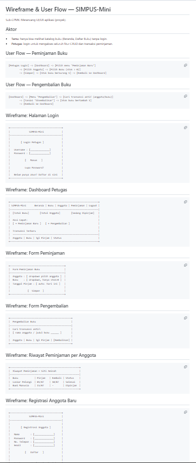

# Jobsheet 4 — UI/UX Design

### Nama : Achmad Pradita Dwi Firmansyah

### Kelas / Absen : TI-2G / 01

### NIM : 254107020130

Sub-CPMK: Merancang UI/UX aplikasi (proyek).

## Perubahan dari Jobsheet 3

- Tidak ada perubahan kode — halaman HTML/CSS tetap sama persis dengan Jobsheet 3.
- Tambah `docs/wireframe.md`: wireframe teks + user flow untuk fitur yang **belum dibangun** (Login, Dashboard Petugas, Peminjaman, Pengembalian, Riwayat).

  

## Catatan

Dokumen `docs/wireframe.md` menjadi acuan struktur HTML baru yang mulai diimplementasikan pada Jobsheet 5 dan seterusnya (interaktivitas JS, lalu PHP/PostgreSQL untuk fitur Login & Peminjaman).
